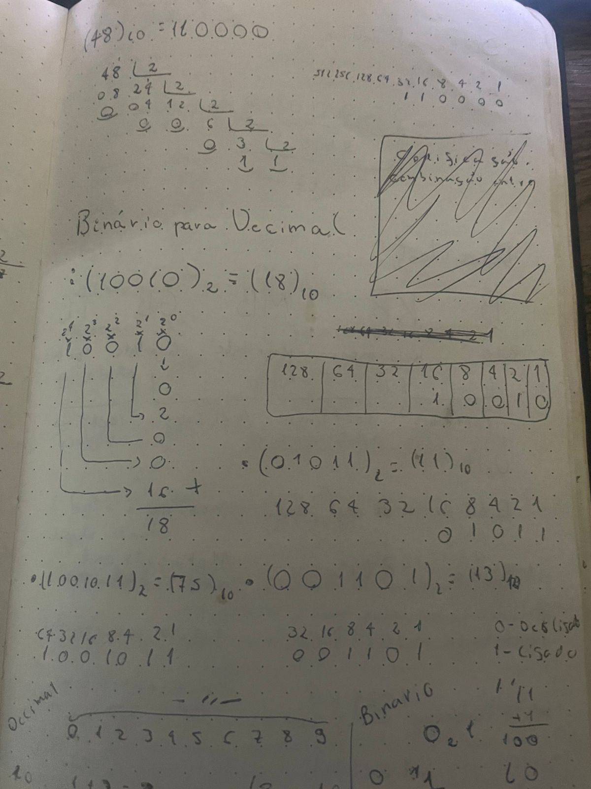
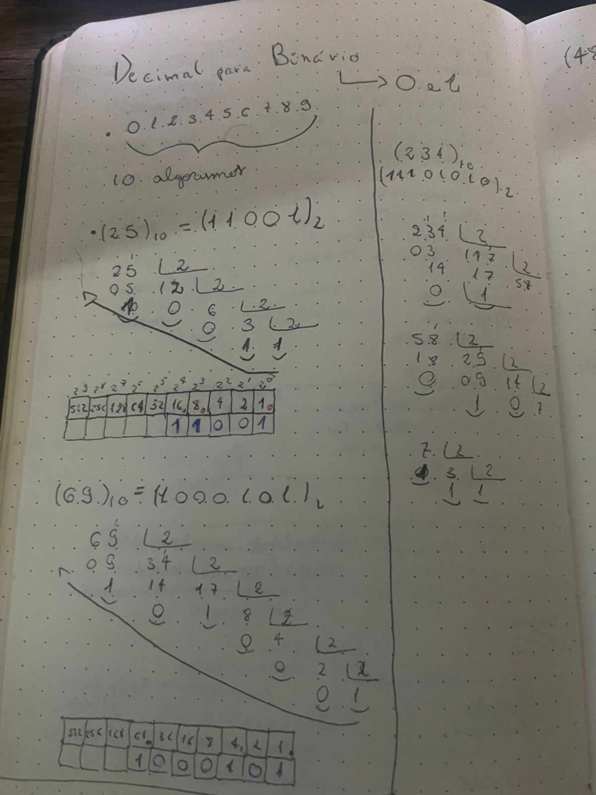

<h1 align="center">Conversão de Bases</h1>

## 📘 Sobre o Projeto
Projeto de estudos com o objetivo de praticar lógica de programação e conversão entre bases numéricas.

## ⚙️ Funcionalidades
- ✅ Converter **binário para decimal**
- ✅ Converter **decimal para binário**
- ✅ Converter **decimal para ASCII**
- ✅ Converter **ASCII para decimal**

## 🛠️ Tecnologias Utilizadas
- ✅ JavaScript / TypeScript

## 💻 Como Executar o Projeto

### Baixar as dependências do projeto
```bash
    npm install
```
### Executar o projeto
```bash
    npm run start
```

## 🖼️ Imagens
<p>
  
</p>
<p>
  
</p>

## 👨‍💻 Autor
### Lucas Gabriel Moya
- 🌐 Website: [lucasgabrielmoya-nu.vercel.app](https://lucasgabrielmoya-nu.vercel.app/)
- 💼 LinkedIn: [Lucas Gabriel Moya](https://www.linkedin.com/in/lucas-gabriel-moya/)
- 📁 Portfólio Notion: [LucasMoya](https://www.notion.so/Lucas-Gabriel-Moya-fc349fed77064d429a8c15664f67f437)